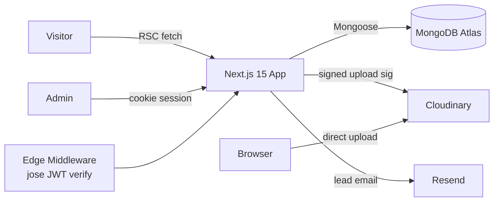

# Requirements

### Overview & Goals
Build a premium personal-brand freelancer portfolio for **Amir Shrestha** positioning him as a React-first developer with MERN + TypeScript and Django expertise. The site sells three productized service tiers and drives users to a single primary conversion: **request a quote / book a call**.

### Primary Conversions
- Request a quote (contact form)
- Book a call (calendar link / CTA)
- View work (case studies)
- Direct contact (email)

### Scope
**In scope**
- Public marketing site (Next.js 15 App Router, RSC where possible)
- Three service tiers with anchor pricing (Static 10k, Dynamic+CMS 25k, E-commerce 450k)
- Case studies / featured work, about, process, testimonials, FAQ, contact
- Authenticated admin dashboard (shadcn/ui) for projects, services, testimonials, FAQs, leads
- Custom JWT + HTTP-only cookie auth, role check (`admin`)
- MongoDB Atlas for all dynamic content + leads
- Cloudinary uploads (signed) for images
- Resend for lead notification emails
- Motion 12 for tasteful section reveals
- SEO, a11y, responsive, reduced-motion support

**Out of scope**
- Payments / Stripe (architecture leaves room)
- Multi-user roles beyond `admin`
- Blog / MDX content (can be added later)
- i18n

### User Stories
- As a **prospect**, I see a clear hero promise and pricing within seconds so I can decide to enquire.
- As a **prospect**, I can read case studies with tech stack and outcomes before contacting.
- As a **prospect**, I submit a contact form and get a thank-you confirmation; Amir gets an email.
- As **Amir (admin)**, I log in via secure cookie session and manage projects, services, testimonials, FAQs and view/triage leads.
- As **Amir (admin)**, I upload images via Cloudinary directly from the dashboard.

### Functional Requirements
- Public site renders nothing for content lists until admin creates entries (empty-state friendly).
- Contact form: zod validation, honeypot + rate-limit, persists to `leads`, emails Amir via Resend, shows thank-you state.
- Admin: `/admin/login`, `/admin` dashboard, CRUD for `projects`, `services`, `testimonials`, `faqs`, read/update for `leads`.
- Auth: JWT signed with `JWT_SECRET`, stored in `HttpOnly`, `Secure`, `SameSite=Lax` cookie; middleware guards `/admin/*` and `/api/admin/*`.
- Cloudinary uploads via signed upload signature endpoint; never expose API secret to client.

### Non-Functional Requirements
- Strict TypeScript (`strict: true`, `noUncheckedIndexedAccess`).
- Lighthouse ≥ 95 perf/SEO/a11y on desktop, ≥ 90 mobile.
- WCAG 2.1 AA: keyboard nav, focus rings, contrast, `prefers-reduced-motion`.
- Responsive: 360 / 768 / 1024 / 1440 / 1920 widths verified.

# Technical Design

### Current Implementation
Empty repository at `C:\Users\Amir\WebstormProjects\myportfolio`. Greenfield build.

### Key Decisions
- **Framework: Next.js 15 (App Router)** — single deployable; server components for SEO; route handlers replace a separate Express layer. Issue's Express dependency is dropped in favor of Next API routes (simpler, same Node runtime). Documented as an intentional deviation.
- **Auth: custom JWT + HTTP-only cookie** with `jose` for signing/verification at the edge (middleware). Single `admin` role from env-seeded user; passwords hashed with `bcryptjs`.
- **Data: MongoDB Atlas + Mongoose** with strict schemas; one connection cached across hot reloads.
- **Media: Cloudinary** with signed client-side uploads; server returns signature only.
- **UI: Tailwind CSS 4 + shadcn/ui**; design tokens in `globals.css` via `@theme`.
- **Motion: `motion/react`** with reduced-motion guard; section-level reveals only.
- **Validation: `zod`** shared between server actions/route handlers and client forms.
- **Content initially empty in DB** — admin populates everything; public pages render polished empty states or hide empty sections.

### Proposed Changes (Architecture)


### Data Models (Mongoose + zod)
- `User { _id, email, passwordHash, role: 'admin', createdAt }`
- `Project { _id, slug, title, summary, description, tech: string[], coverImage{url,publicId}, gallery[], liveUrl?, repoUrl?, impact?, featured: boolean, order, publishedAt }`
- `Service { _id, slug: 'static'|'dynamic-cms'|'ecommerce', name, tagline, startingPrice, currency:'NPR', deliverables: string[], timeline, revisions, upgradePaths: string[], order }`
- `Testimonial { _id, author, role, company?, quote, avatar?, rating?, order }`
- `Faq { _id, question, answer, order }`
- `Lead { _id, name, email, phone?, company?, budget?, package?, message, source, status:'new'|'contacted'|'won'|'lost', createdAt, ip, ua }`

### API / Route Handlers
- `POST /api/auth/login` — sets cookie
- `POST /api/auth/logout`
- `POST /api/leads` — public, rate-limited, honeypot, zod-validated, Resend email
- `GET/POST/PATCH/DELETE /api/admin/projects|services|testimonials|faqs|leads`
- `POST /api/admin/uploads/signature` — Cloudinary signed params

### File Structure
```
myportfolio/
  app/
    (site)/
      layout.tsx           # public layout, nav, footer
      page.tsx             # hero + sections composition
      work/[slug]/page.tsx # case study detail
      thank-you/page.tsx
    admin/
      layout.tsx           # gated shell
      login/page.tsx
      page.tsx             # dashboard overview
      projects/...
      services/...
      testimonials/...
      faqs/...
      leads/...
    api/
      auth/[login|logout]/route.ts
      leads/route.ts
      admin/.../route.ts
  components/
    sections/ (Hero, About, Services, Work, Process, Testimonials, FAQ, Contact)
    ui/ (shadcn primitives)
    motion/ (Reveal, Stagger)
    admin/ (DataTable, ImageUploader, Forms)
  lib/
    db.ts            # mongoose singleton
    auth.ts          # jose sign/verify, cookie helpers
    cloudinary.ts    # signature
    email.ts         # Resend client
    validation/      # zod schemas (shared)
    rate-limit.ts
  models/            # mongoose models
  middleware.ts      # protects /admin and /api/admin
  styles/globals.css # tailwind v4 @theme tokens
  scripts/seed-admin.ts
  .env.example
```

### Components (key)
- `Hero` — name, role, positioning, dual CTA (Quote / View Work).
- `ServicesGrid` — three `ServiceCard`s with price anchor, deliverables, timeline, CTA.
- `WorkGrid` + `CaseStudyCard` — cover, impact metric chips, tech badges.
- `ProcessTimeline`, `Testimonials`, `Faq` (accordion), `ContactForm`.
- `Reveal` — motion wrapper, respects `prefers-reduced-motion`.
- Admin: `ProjectForm`, `ImageUploader` (Cloudinary signed), `LeadsTable`.

### Risks
- Tailwind v4 + shadcn/ui compat: pin to versions known to work; use the v4 shadcn install path.
- Edge middleware can't use Mongoose — use `jose` JWT verify only at edge; DB calls in node runtime.
- Issue specifies Express 5; deviation documented — Next route handlers cover the same needs.

# Testing

### Validation Approach
Agent-verifiable checks via build, type-check, lint, and HTTP smoke tests against the dev server.

### Key Scenarios
- `pnpm build` succeeds under strict TS.
- `GET /` renders 200 with hero + service tier prices visible in HTML.
- `POST /api/leads` with valid payload → 201, document in `leads`, Resend called (mock in test mode).
- `POST /api/auth/login` with seeded admin → sets `HttpOnly` cookie; subsequent `GET /admin` returns 200; without cookie returns 307 to `/admin/login`.
- Cloudinary signature endpoint requires auth and returns valid `signature`+`timestamp`.

### Edge Cases
- Lead form: missing fields, invalid email, honeypot filled, rate-limit exceeded → 4xx with field errors.
- Auth: wrong password, expired JWT, tampered cookie → 401/redirect.
- Reduced motion: `prefers-reduced-motion: reduce` disables `Reveal` transforms.
- Empty DB: public sections (work/testimonials/faqs) hide gracefully; services section shows defined empty state.

### Test Changes
- Add `vitest` + `@testing-library/react` for unit tests on zod schemas, `auth.ts`, and `ContactForm`.
- Add a minimal Playwright smoke test for login → dashboard → logout.

# Delivery Steps

###   Step 1: Bootstrap Next.js 15 + Tailwind v4 + shadcn/ui foundation
Project skeleton compiles under strict TS with the design system ready to use.

- Initialize Next.js 15 App Router project with TypeScript strict mode (`strict`, `noUncheckedIndexedAccess`, `noImplicitOverride`).
- Configure ESLint, Prettier, `.editorconfig`, `.env.example`, and `pnpm` scripts.
- Install and configure Tailwind CSS 4 and shadcn/ui; create `globals.css` with `@theme` design tokens (colors, spacing, radii, shadows, fonts).
- Add base layout, font loading (`next/font`), site metadata, favicon, `robots.ts`, `sitemap.ts`.
- Add `Reveal`/`Stagger` motion wrappers using `motion/react` with `prefers-reduced-motion` guard.

###   Step 2: Build public marketing pages with empty-state-ready sections
Public site renders hero, services, work, process, testimonials, FAQ and contact sections — each driven by data (empty until admin populates).

- Implement `Hero`, `About`, `ServicesGrid` (three tier cards with price anchors 10k / 25k / 450k NPR, deliverables, timeline, upgrade paths), `WorkGrid`, `ProcessTimeline`, `Testimonials`, `Faq`, `ContactSection`.
- Implement `app/(site)/work/[slug]/page.tsx` case-study detail page.
- Wire sections to read from Mongo via server components; hide or show polished empty states when no data.
- Ensure responsive layouts at 360/768/1024/1440 and AA contrast / keyboard nav.

###   Step 3: Set up MongoDB Atlas data layer and zod validation
Mongoose models, shared zod schemas, and DB singleton are in place for all entities.

- Add `lib/db.ts` cached Mongoose connection.
- Create models: `User`, `Project`, `Service`, `Testimonial`, `Faq`, `Lead` with strict schemas and indexes (`Project.slug` unique, `Lead.createdAt`).
- Create matching `lib/validation/*.ts` zod schemas reused by server and client.
- Add `scripts/seed-admin.ts` to create the first admin from env vars.

###   Step 4: Implement JWT + HTTP-only cookie auth and route protection
Admin can log in/out securely; `/admin/*` and `/api/admin/*` are gated.

- Implement `lib/auth.ts` using `jose` for sign/verify and `bcryptjs` for password hashing.
- Add `POST /api/auth/login`, `POST /api/auth/logout` route handlers setting `HttpOnly`, `Secure`, `SameSite=Lax` cookies.
- Add `middleware.ts` doing edge JWT verification and redirecting unauthenticated `/admin/*` to `/admin/login`.
- Add `app/admin/login/page.tsx` with shadcn form and zod validation.

###   Step 5: Build admin dashboard with CRUD for content entities
Authenticated admin can manage projects, services, testimonials and FAQs end-to-end.

- Create `app/admin/layout.tsx` shell (sidebar, header, logout) using shadcn/ui.
- Implement list + form pages for `projects`, `services`, `testimonials`, `faqs` with `DataTable` and reusable `EntityForm` components.
- Implement `GET/POST/PATCH/DELETE /api/admin/<entity>/route.ts` with zod validation and auth guard.
- Add ordering controls (`order` field) and `featured` toggles where relevant.

###   Step 6: Integrate Cloudinary signed uploads in admin
Admins upload images directly to Cloudinary from project/testimonial forms.

- Add `lib/cloudinary.ts` server signature helper and `POST /api/admin/uploads/signature` (auth-gated).
- Build `ImageUploader` client component that fetches the signature and uploads directly to Cloudinary, returning `{ url, publicId }`.
- Wire uploader into `ProjectForm` (cover + gallery) and `TestimonialForm` (avatar); persist `publicId` for future deletion.

###   Step 7: Implement lead capture, Resend email, and admin leads inbox
Public contact form stores leads, emails Amir, and shows a thank-you page; admin can triage submissions.

- Build `ContactForm` with zod, honeypot field and inline errors; submit to `POST /api/leads`.
- Implement rate limiting (`lib/rate-limit.ts`, IP+route), spam checks, and persistence to `leads`.
- Send notification via Resend in `lib/email.ts` with a templated HTML email; on success redirect to `/thank-you`.
- Build `app/admin/leads` list with status filter and detail drawer; `PATCH /api/admin/leads/:id` updates `status`.

###   Step 8: Polish: SEO, accessibility, performance, and verification
Site is launch-ready with measurable quality gates.

- Per-page metadata, Open Graph images, JSON-LD `Person` + `Service` schemas, `sitemap.ts`, `robots.ts`.
- Audit a11y: focus rings, skip link, form labels, color contrast, reduced-motion fallbacks.
- Optimize images via `next/image` + Cloudinary transformations; verify Lighthouse ≥ 95 desktop / ≥ 90 mobile.
- Add `vitest` unit tests for zod schemas and `auth.ts`; Playwright smoke test for login→dashboard→logout and lead submission.
- Final review across 360/768/1024/1440 widths and copy pass for CTAs and pricing clarity.